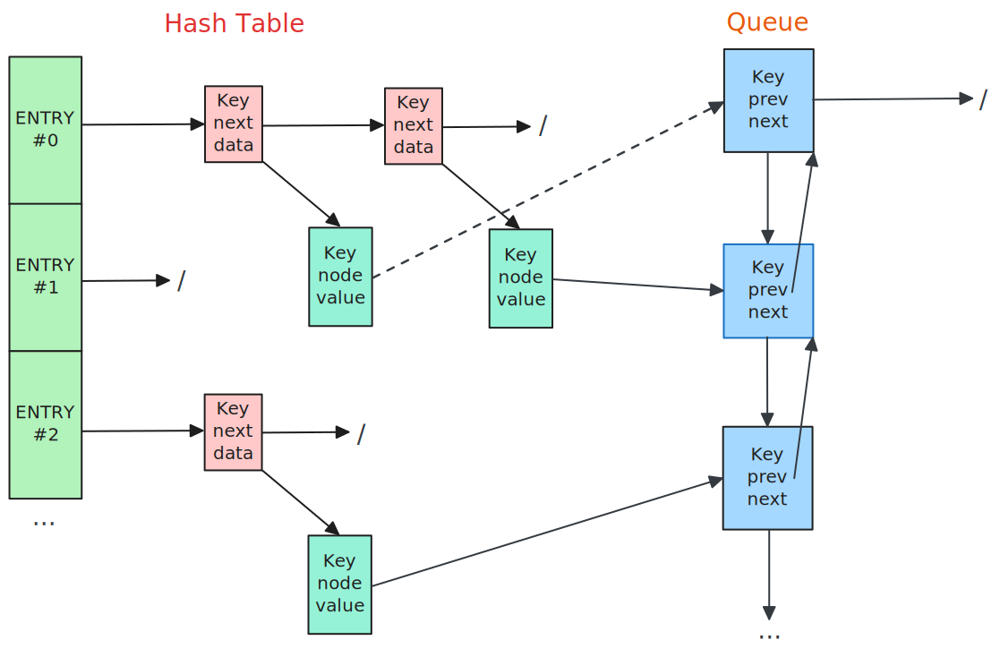

# LRU 缓存

> LRU 缓存的经典实现结构——哈希表与双向链表的组合，同时满足‘快速查找数据’和‘按访问时序淘汰数据’的核心需求。

## 概述

LRU 缓存，全称 **Least Recently Used（最近最少使用）缓存**，是一种经典的缓存数据结构，核心目标是**在有限的缓存容量下，优先保留 “最近被访问过的数据”，当缓存满时，自动淘汰“最久未被使用的数据”**，以此平衡数据访问速度与缓存容量限制，解决高成本存储（如硬盘、网络服务器）访问效率低的问题。

<div align="center">
  
</div>

此图展示了 LRU（最近最少使用）缓存的经典实现结构——哈希表与双向链表（队列）的组合，同时满足“快速查找数据”和“按访问时序淘汰数据”的核心需求，在有限容量下最大化缓存命中率，最终降低对高成本存储的依赖，提升数据访问效率，是解决速度与容量矛盾的经典方案。

## 哈希表

左侧哈希表的主要作用是实现 O(1) 时间复杂度的快速查找，解决“如何快速判断数据是否在缓存中”的问题。其结构采用“**桶+ 链地址法**”处理哈希冲突：多个桶组成哈希表，每个桶对应一条链表，链表节点存储 Key，数据 data、以及指向后继节点的指针 next，其中 data 本身又是一个结构体或者指针/引用（当数据量大、复制成本高时），包括 key，value、以及指向队列中的结点指针 node。

## 双向链表（队列）

右侧的双向链表则用于维护数据的访问时序，解决“如何识别并淘汰‘最少最近使用’数据”的问题。其结构细节表现为：链表节点存储Key，以及 prev（前驱指针）和 next（后继指针），支持双向遍历与节点的快速插入/删除（无需扫描整个链表）。同时，链表的头部是“最少最近使用”的数据（**缓存满时优先被淘汰**），尾部是“最近使用”的数据（**最后被淘汰**）。

## 协同工作

哈希表与双向链表通过指针关联，形成“快速查找 + 时序追踪”的闭环，实现协同工作。当访问某个 Key 时，哈希表先通过 Key 快速定位到对应项，再通过哈希表项中的链表节点指针找到该 Key 在双向链表中的位置，最后将该节点移动到双向链表的**尾部**（标记为“最近使用”，避免被误淘汰）。而当缓存已满需淘汰数据时，会直接删除双向链表的**头部节点**（即“最少最近使用”的数据），并**同步**通过节点中的 Key 从哈希表中移除对应项，为新数据腾出空间。这种“哈希表 + 双向链表”的组合，让 LRU 缓存同时具备“快速查找效率”和“按访问时序淘汰的能力”，是平衡缓存速度与容量的经典设计。

## 参考文献

```tex
{
  author = "Jeremy Kubica",
  year = "2022",
  booktitle = "Data Structures the Fun Way: An Amusing Adventure with Coffee-Filled Examples",
  chapter = "11",
  chapter_title = "Caches",
  publisher = "No Starch Press"
}
```

