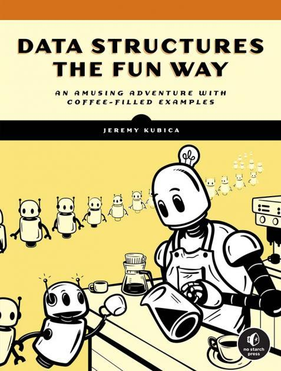

## 介绍

  

这本通俗易懂且趣味十足的书籍，从数据结构的视角深入讲解计算思维，通过示意图、伪代码与风趣的类比，你将理解数据的结构如何驱动算法运算，不仅能掌握数据结构的构建方法，更能明确它们的使用场景与方式。

本书将帮助你扎实掌握 15 种以上关键数据结构的实现与运用，涵盖栈、队列、缓存，到布隆过滤器、跳表、图等各类结构。你可以通过 “在咖啡馆排队” 理解链表，通过 “梳理夏季奥运会历史” 掌握哈希表，还能通过 “规整厨房橱柜” 学会四叉树。

## 目标

1. 目前市面上多数数据结构书籍侧重链表、栈、队列等基础结构，而对字典树、优先队列、堆、网格、空间树、缓存、布隆过滤器、跳表等进阶结构涉及较少，而实际上这些数据结构应用广泛：字典树用于搜索引擎补全与数据库索引；优先队列和堆应用于操作系统调度与大数据处理；网格支撑地理信息系统和游戏渲染；空间树关键用于 3D 建模和无人机避障；缓存提升 Web 与 Redis 响应效率；布隆过滤器适用于分布式系统判重与垃圾邮件过滤；跳表是 Redis 有序集合的核心实现。此书以精炼篇幅介绍这些主流结构，补足了传统教材的不足。
2. 不同于原书的伪代码描述，本项目采用现代 C++ 语法完整实现所有数据结构，旨在系统提升自身的 C++ 语言编程能力，深入理解面向对象设计、内存管理、模板编程等核心概念。同时，项目还涵盖了 CMake 编译构建系统的实际应用，包括如何组织项目结构、编写 CMakeLists.txt 以及管理多文件工程。此外，在实践中也将掌握 hpp 与 tpp 头文件的组织方式及其在模板类实现中的关键作用，增强工程化实现能力。

